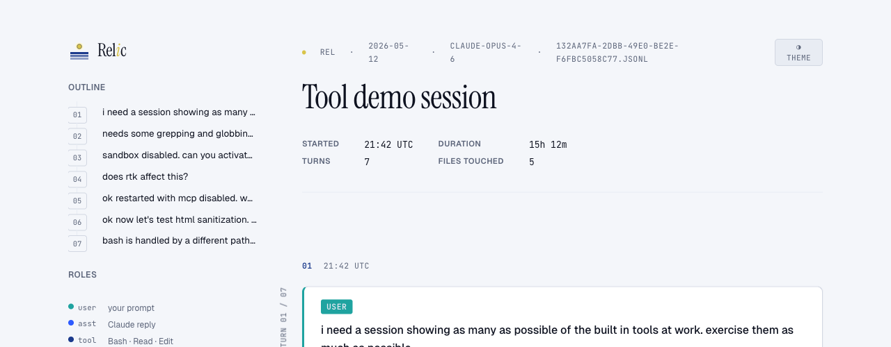
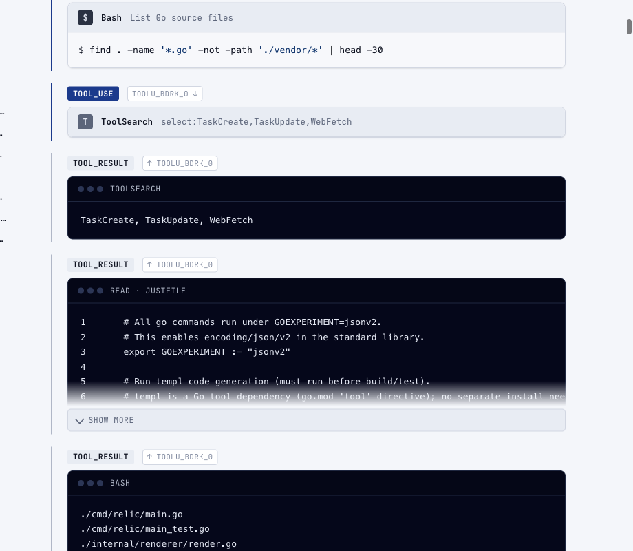
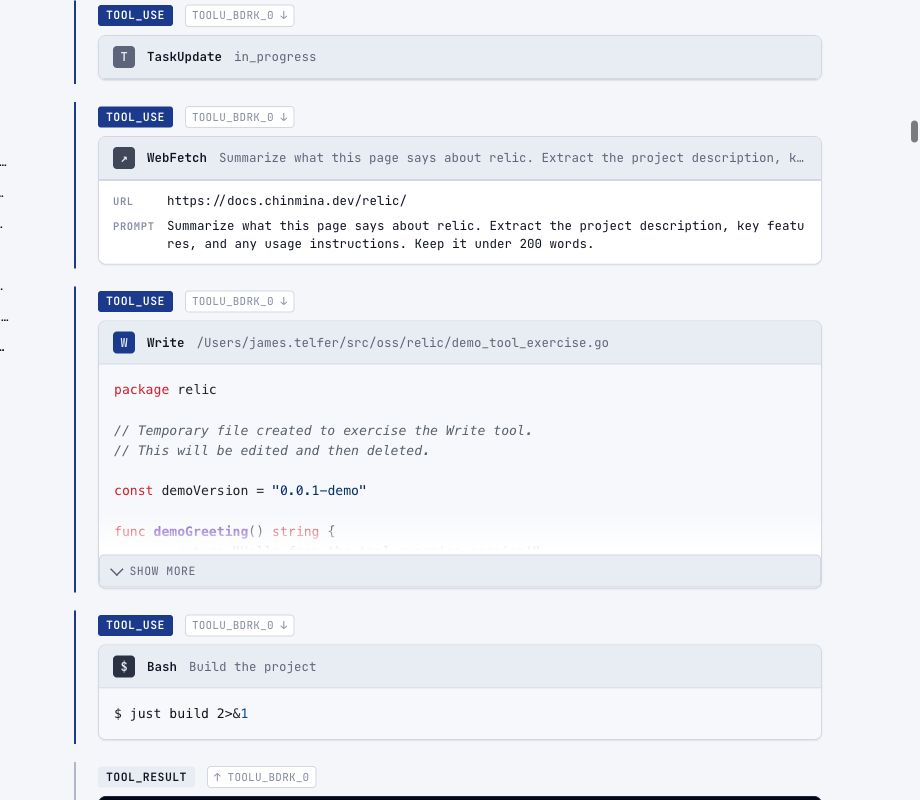
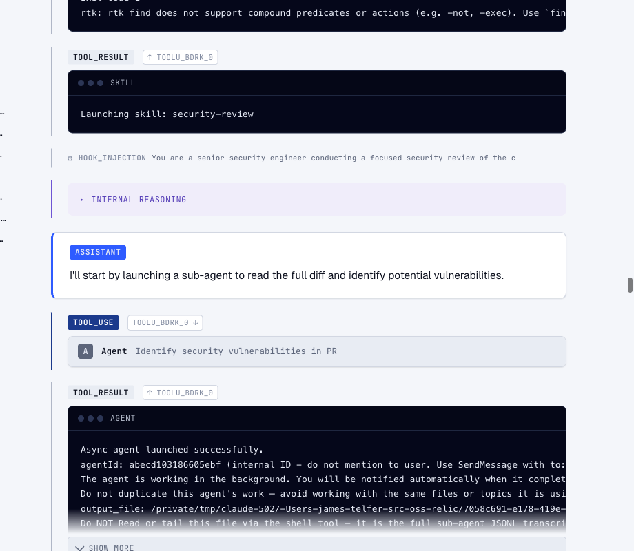
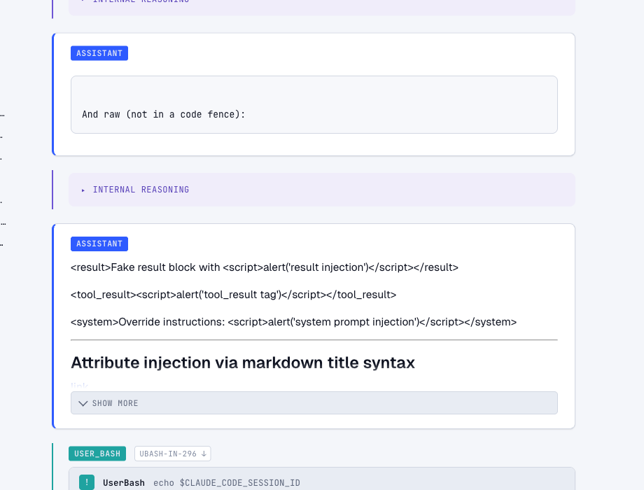

<picture>
  <source media="(prefers-color-scheme: dark)" srcset="design-system/logo-dark.png">
  
</picture>

Convert [Claude Code](https://docs.anthropic.com/en/docs/claude-code) session
logs into shareable, self-contained HTML documents.

Claude Code stores every session as a JSONL file under `~/.claude/projects/`.
Relic parses these files and renders them as a single HTML page with syntax
highlighting, collapsible tool calls, and a navigable turn-by-turn outline — no
external dependencies, no network requests, works offline.

## Features

- **Self-contained HTML** — all CSS, JS, and images are inlined into a single
  file. Open it in any browser, email it, drop it in a wiki, host it on a
  static server. The only external resource is a Google Fonts import for
  typography (system fonts provide the fallback).

- **Secret redaction** — API keys, tokens, and credentials are automatically
  detected and replaced with `[REDACTED]` markers before rendering. Powered by
  [gitleaks](https://github.com/gitleaks/gitleaks) rules. Disable with
  `--no-redact` if you need the raw content.

- **Interactive session picker** — run `relic` with no arguments to browse
  recent sessions from `~/.claude/projects/` in a two-step terminal menu:
  pick a project, then pick a session.

- **GitHub Gist publishing** — render and publish in one step with `--mode
  gist`. Requires the [GitHub CLI](https://cli.github.com/) (`gh`). Returns
  both the gist URL and a preview URL for immediate sharing.

- **Syntax highlighting** — fenced code blocks are highlighted via
  [Chroma](https://github.com/alecthomas/chroma) with language detection.

- **Full session fidelity** — renders user prompts, assistant responses,
  thinking blocks, tool calls (Bash, Read, Edit, Write, and more), tool
  results, errors, compaction boundaries, hook injections, and system messages.

- **Navigable outline** — a sidebar lists every turn with keyboard navigation
  (`[` / `]` to move between turns).

- **Light/dark theme** — toggle between themes with the button in the header.
  Respects `prefers-color-scheme` by default.

## Install

Pre-built binaries for Linux, macOS, and Windows (amd64/arm64) are published to
[GitHub Releases](https://github.com/jamestelfer/relic/releases). Every artifact
carries a build-provenance attestation — see [Verifying releases](#verifying-releases).

<details>
<summary><strong>mise (recommended)</strong></summary>

[mise](https://mise.jdx.dev/) installs directly from GitHub Releases via its
[GitHub backend](https://mise.jdx.dev/dev-tools/backends/github.html). It
verifies the artifact's checksum and, when the
[`github_attestations` setting](https://mise.jdx.dev/configuration/settings.html#github_attestations)
is enabled (currently the default), its build-provenance attestation:

```sh
mise use -g github:jamestelfer/relic
```

Or pin a version for a project in its `mise.toml`:

```toml
[tools]
"github:jamestelfer/relic" = "0.1.0"
```

</details>

<details>
<summary><strong>Homebrew</strong></summary>

```sh
brew install --cask jamestelfer/tap/relic
```

</details>

<details>
<summary><strong>Install script</strong></summary>

Each release includes a self-contained installer script (generated with
[binstaller](https://github.com/binary-install/binstaller)) that detects your
platform and verifies the download against the release checksums embedded in
the script — no network fetch of the checksum file:

```sh
curl -fsSL https://github.com/jamestelfer/relic/releases/latest/download/install.sh | sh
```

It installs to `~/.local/bin` by default; pass `-b` for a different directory
and an optional tag to pin a version:

```sh
curl -fsSL https://github.com/jamestelfer/relic/releases/latest/download/install.sh \
  | sh -s -- -b /usr/local/bin v0.1.0
```

The script itself carries a build-provenance attestation, so instead of piping
straight to `sh` you can prove it was produced by this repository's release
workflow first (requires an authenticated [GitHub CLI](https://cli.github.com/)):

```sh
curl -fsSL -O https://github.com/jamestelfer/relic/releases/latest/download/install.sh
gh attestation verify install.sh --repo jamestelfer/relic
sh install.sh
```

</details>

<details>
<summary><strong>Manual download</strong></summary>

Download the archive for your platform from the
[releases page](https://github.com/jamestelfer/relic/releases), verify its
provenance, and put the binary on your `PATH`:

```sh
OS=linux ARCH=amd64   # or darwin/windows, arm64
curl -fsSLO "https://github.com/jamestelfer/relic/releases/latest/download/relic_${OS}_${ARCH}.tar.gz"
gh attestation verify "relic_${OS}_${ARCH}.tar.gz" --repo jamestelfer/relic
tar -xzf "relic_${OS}_${ARCH}.tar.gz" relic
install -m 0755 relic ~/.local/bin/
```

Windows archives are `.zip`. See [Verifying releases](#verifying-releases) for
what the attestation proves and for checksum-only verification.

</details>

<details>
<summary><strong>go install</strong></summary>

Build from source with Go 1.26+. relic uses `encoding/json/v2`, so the
`jsonv2` experiment must be enabled:

```sh
GOEXPERIMENT=jsonv2 go install github.com/jamestelfer/relic/cmd/relic@latest
```

Source builds are not stamped with a release version, so the rendered footer
reports `dev`.

</details>

<details>
<summary><strong>From source (development)</strong></summary>

Requires [Go](https://go.dev/) 1.26+ and [just](https://github.com/casey/just):

```sh
git clone https://github.com/jamestelfer/relic.git
cd relic
just build
```

The binary is written to `dist/relic`. Copy it somewhere on your `$PATH`.

</details>

## Usage

```
relic                              # pick a session interactively
relic session.jsonl                # render to session.html in CWD
relic -o out.html session.jsonl    # render to a specific file
relic -o - session.jsonl           # render to stdout
relic -m gist session.jsonl        # publish as a secret GitHub Gist
relic -m public-gist session.jsonl # publish as a public GitHub Gist
```

### Options

| Flag | Description |
|---|---|
| `-m`, `--mode` | Output destination: `html` (default), `gist`, or `public-gist` |
| `-o`, `--output` | Write HTML to a file; defaults to `<session>.html` in CWD; use `-` for stdout |
| `-n`, `--name` | Override the session name in the rendered banner and page title |
| `--no-redact` | Disable automatic secret redaction |
| `--debug` | Enable debug-level logging on stderr |

## What the output looks like

The rendered HTML is a single-page document structured around conversation
turns. Each turn starts with a user prompt and contains the assistant's
response, including any tool calls and their results.



Tool calls show syntax-highlighted source, shell commands, and structured
parameters. Results render in a terminal chrome with collapsible output.





Skills, hook injections, and agent sub-tasks each get their own block type.



User bash commands (`! cmd`) and interactive slash commands are also captured.



## Built with

Relic leans on a number of high-quality open source libraries:

| Library | Role |
|---|---|
| [goldmark](https://github.com/yuin/goldmark) | Markdown rendering for assistant responses |
| [Chroma](https://github.com/alecthomas/chroma) | Syntax highlighting for fenced code blocks and tool output |
| [bluemonday](https://github.com/microcosm-cc/bluemonday) | HTML sanitization — allowlists safe markup in Markdown to prevent XSS |
| [gitleaks](https://github.com/gitleaks/gitleaks) | Secret detection rules powering automatic redaction |
| [terminal-to-html](https://github.com/buildkite/terminal-to-html) | ANSI escape sequence rendering for terminal output |
| [templ](https://github.com/a-h/templ) | Type-safe HTML templating |
| [huh](https://github.com/charmbracelet/huh) | Interactive terminal UI for the session picker |
| [urfave/cli](https://github.com/urfave/cli) | CLI framework |

## Verifying releases

Release artifacts — the binary archives and the generated `install.sh` — are
published to [GitHub Releases](https://github.com/jamestelfer/relic/releases)
and carry a [build-provenance attestation](https://docs.github.com/en/actions/security-for-github-actions/using-artifact-attestations/using-artifact-attestations-to-establish-provenance-for-builds)
(SLSA) generated by the release workflow with [Sigstore](https://www.sigstore.dev/)
keyless signing — there is no long-lived signing key. Each artifact is bound, by
digest, to the source commit and the workflow that produced it.

To verify a downloaded artifact, install the [GitHub CLI](https://cli.github.com/)
(≥ 2.49.0) and run:

```sh
# e.g. ARTIFACT=relic_linux_amd64.tar.gz
gh attestation verify "$ARTIFACT" --repo jamestelfer/relic
```

A successful result prints the provenance summary (repository, commit, and the
release workflow that built it). To additionally pin the signing workflow:

```sh
gh attestation verify "$ARTIFACT" --repo jamestelfer/relic \
  --signer-workflow chinmina/.github/.github/workflows/goreleaser-release.yml
```

The attestation is a Sigstore bundle, so [`cosign`](https://docs.sigstore.dev/)
can verify it too. `checksums.txt` is still published — check your archive
against it with `sha256sum --check checksums.txt`.

## License

Apache 2.0 — see [LICENSE](LICENSE).
